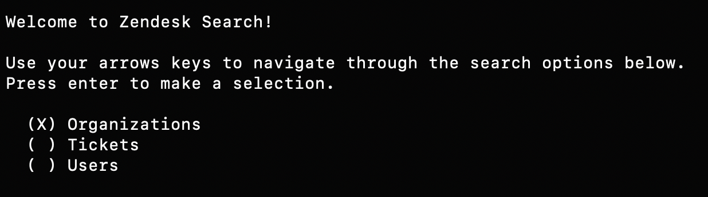
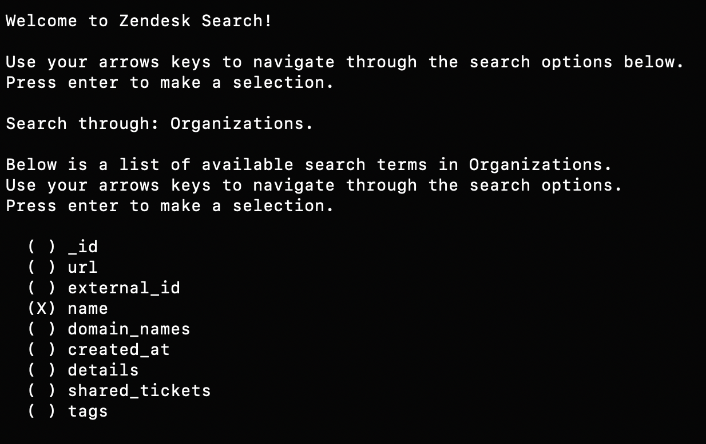
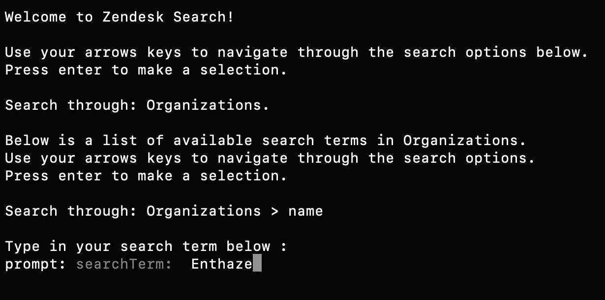
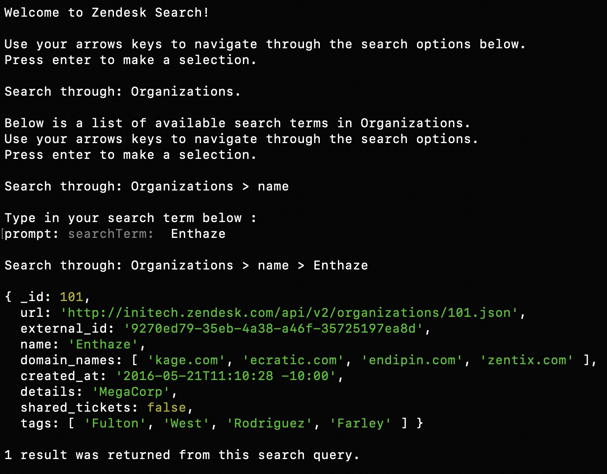

# Zendesk Search App
## To run the app
- Navigate into the project folder
- Run `npm install` 
  
```
npm install
```
- Run `npm run search` 
  
```
npm run search
```
- Follow the instructions in the terminal to navigate through the search app
    - Select to search through Organizations, Tickets or Users

    - Select to search through the searchable fields in each database

    - Type in the desired search term

    - Press enter to return search results

- Run `npm run search` to restart the process

## Scripts
- Run eslint
  ```
  npm run lint
  ```
- Run jest tests
  ```
  npm test
  ```
- Run app
  ```
  npm run search
  ```

## Directories 
### data
- This directory contains all the json data files. 

### src
- This directory contains all the logic for the app.
- Within `input.js` are the functions that handles user inputs :
  - `getObjId` : Uses cliSelect to prompt user to input the desired databases to search through
  - `getSelectedOb` : Gets the required database using the given id
  - `getKeys` : Gets the searchable fields in each database
  - `getSelectedKey` : Uses cliSelect to prompt user to input the desired searchable field to search through

- Within `data.js` are the functions that handles the search request : 
  - `getRelatedDataByOrgId` : Given the org id, fetches the related data from both the tickets and users databases 
  - `getRelatedDataByUserId` : Given the user id or ticket user id, fetches the related data from both the tickets and users databases
  - `getSearchResults` : Given the search inputs, fetches the related data
  - `sortSearch` : Sorts the search request to trigger the correct functions to retrieve the correct data
- `index.js` kicks off our app. Console logs the results of the search request  after calling functions to get the user's input and retrieve related data across databases. 
### unitTests
- Contains the unit tests written for the solution

## Assumptions and Tradeoffs
- I have chosen not to provide an option to see all searchable fields as selecting the desired database returns all the searchable fields within that database.
- Given that the user is only given the viable search options in the initials steps of the search process, the only place where the search could fail is in the text input. 
- As stated in the challenge instructions, only full value mathcing is employed.
- If given more time, I would have liked to resolve or improve the fact that:  
  - there is no function to return to the previous step in the search process.
  - the results display is not easily legible. 
  - the test coverage currently sits at around 80% .

## Tech stack
- JavaScript
- node v11.6.0
- npm
- prompt
- cliSelect
- eslint
- Jest